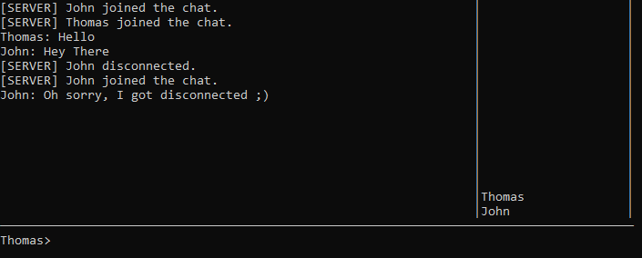

# CLI Chat app

The Solution builds into 2 executables: Server and Client.

The Networking is realized using WebSockets and running on localhost.

When a user is typing, they will have a `*` appended to their username.

### How to Run
1. Build the solution
2. Run the server
3. Run Client(s)
